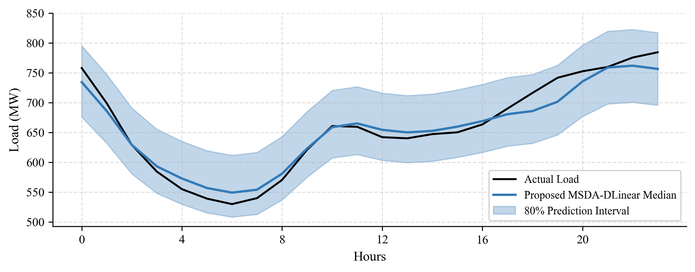
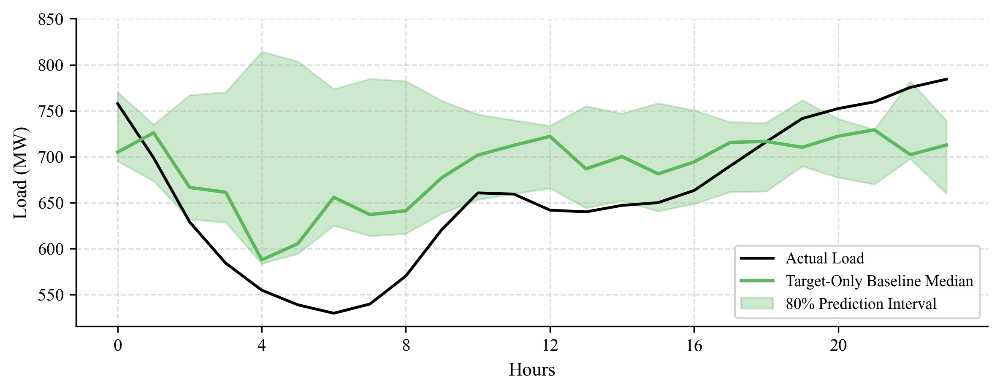
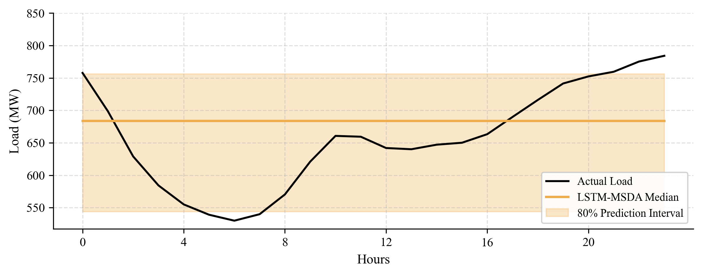

# MSDA-DLinear: Trend-Seasonal Decoupled Domain Adaptation for Probabilistic Load Forecasting
Official implementation of the paper *"Uncertainty-Aware Load Forecasting for Data-Scarce Grids: A Trend-Seasonal Decoupled Domain Adaptation Approach"*.

## Overview
**MSDA-DLinear** is a lightweight framework for few-shot probabilistic load forecasting.  
It decouples load sequences into **trend** and **seasonal** components, aligns only the trend subspace across source domains via **MMD**, and outputs quantile predictions to form well-calibrated prediction intervals.

## Key Contributions

- **Trend-Seasonal Decoupled Alignment for Mitigating Negative Transfer**  
  Unlike standard global domain adaptation, we decompose each load sequence into a macro‑trend and a seasonal component, and restrict the Maximum Mean Discrepancy (MMD) penalty exclusively to the trend subspace. This selective alignment transfers domain‑invariant climate‑load relationships from source regions while intentionally protecting the target node's local diurnal and seasonal characteristics from source‑domain noise.

- **Uncertainty Quantification via Lightweight Linear Backbone**  
  To address the over‑parameterization issues typical of complex recurrent networks under extreme data scarcity, we adopt a linear backbone (DLinear) regularized by training‑time dropout. Rather than relying on computationally expensive Monte Carlo approximations, we employ Multi‑Quantile Regression that directly outputs the 10th, 50th, and 90th percentiles through the pinball loss, yielding well‑calibrated and sharp prediction intervals without the uninformative bounds often produced by over‑fitted deep models.

- **Robustness in Data‑Scarce, Few‑Shot Settings**  
  Evaluated under a strict chronological backward‑split protocol, the proposed method achieves a PICP of 75.47% under 6.0% data sparsity and maintains stable performance across sparsity levels from 25.0% down to 6.0%. It demonstrates the capability to forecast unobserved summer cooling peaks using limited autumn/winter training data, providing practical operational boundaries for spinning reserve allocation.

## Installation

```bash
git clone https://github.com/yoyo700/msda-dlinear.git
cd msda-dlinear
pip install -r requirements.txt
```

## Data Preparation

1. Download the **GEFCom2017** dataset.
2. Rename the cleaned CSV to `gefcom2017_clean.csv` and place it in the `dataset/` folder.
3. Ensure the CSV contains the following columns: `zone`, `time`, `load`, `temp`, `dew_pt`.

## Quick Start

```bash
python main.py --scenario 2 --few_shot_ratio 0.06
```

**Key arguments:**
- `--scenario`: `1` (Intra-state), `2` (Climate-aligned, default), `3` (Urban-to-Rural)
- `--few_shot_ratio`: fraction of target training data (default `0.06`)
- `--data_path`: path to the GEFCom2017 CSV
- `--rebuild_cache`: retrain from scratch
- `--device`: `cuda` or `cpu`

## Project Structure

```text
msda-dlinear/
├── dataset/
│   └── gefcom2017_clean.csv
├── models/
│   ├── __init__.py
│   ├── layers.py
│   ├── dlinear.py
│   └── lstm.py
├── results/              # output figures and CSVs
├── cache/                # data and model caches
├── main.py               # main entry point (CLI)
├── data_utils.py         # dataset, preprocessing, seed
├── losses.py             # pinball loss, MMD loss, dynamic weight
├── train_eval.py         # training and evaluation loops
├── plot_utils.py         
├── requirements.txt
└── README.md
```

##  Results (Scenario 2: Climate-aligned, 6.0% data sparsity)

All metrics are computed on the **8760‑hour test set** (year 2017) of the Vermont (VT) zone, using the GEFCom2017 benchmark. The prediction interval targets an 80% nominal coverage level.

| Model | Strategy | Pinball ↓ | PICP (%) ↑ | PINAW ↓ |
| :--- | :--- | :---: | :---: | :---: |
| **DLinear (Ours)** | **MSDA (Selective)** | **12.44** | **75.47** | **0.192** |
| DLinear (Ablation) | Holistic-MSDA | 12.60 | 71.40 | 0.185 |
| DLinear | Target-Only | 32.20 | 30.59 | 0.250 |
| LSTM | MSDA | 24.02 | 67.31 | 0.341 |

* **DLinear (Ours)**: the proposed MSDA‑DLinear with trend‑seasonal decoupling.
* **DLinear (Ablation)**: holistic MMD alignment without decoupling.
* **DLinear (Target‑Only)**: trained exclusively on the sparse target data.
* **LSTM (MSDA)**: LSTM‑based model with the same selective MSDA strategy.

## Visualization (Scenario 2, 6.0% Sparsity, Summer Peak Day)

The following 24‑hour probabilistic forecasts are generated on a representative summer weekday peak (July 31, 2017) with only 6% autumn/winter training data.

### (a) Proposed MSDA-DLinear
<p align="center">
  
</p>

* **Insight:** Accurately tracks the non-linear dual‑peak summer profile with sharp, adaptive prediction intervals, demonstrating the effectiveness of transferring macro-climate responses.

---

### (b) Target-Only Baseline
<p align="center">
  
</p>

* **Insight:** Suffers a severe calibration failure. Deprived of historical summer patterns, it fails to anticipate the afternoon load surge, causing the true load to pierce the prediction boundaries.

---

### (c) LSTM-MSDA
<p align="center">
  
</p>

* **Insight:** Defaults to a static mean-value prediction and outputs an excessively wide "ocean of uncertainty." This reveals the overfitting and over-parameterization issues of complex RNNs under extreme data scarcity.

> **Note:** The figures are generated automatically after running `python main.py --scenario 2 --few_shot_ratio 0.06`. If you want to use a different format (e.g., PDF or SVG), modify the file extension in `plot_utils.py`.
